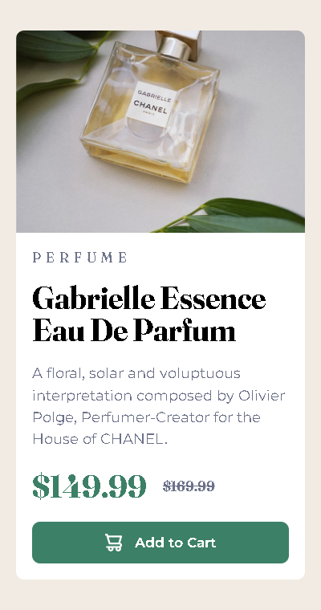

# Frontend Mentor - Product Preview Card Component Solution

This is my solution to the [Product Preview Card Component challenge on Frontend Mentor](https://www.frontendmentor.io/challenges/product-preview-card-component-GO7UmttRfa). This challenge helped me improve my HTML and CSS skills by building a responsive card component.

## Table of Contents

- [Overview](#overview)
  - [The Challenge](#the-challenge)
  - [Screenshot](#screenshot)
  - [Links](#links)
- [My Process](#my-process)
  - [Built With](#built-with)
  - [What I Learned](#what-i-learned)
  - [Continued Development](#continued-development)
  - [Useful Resources](#useful-resources)
- [Author](#author)

## Overview

### The Challenge

Users should be able to:

- View the optimal layout for the component depending on their device's screen size.
- See hover and focus states for elements.

### Screenshot

Tablet and Desktop

Mobile Device

### Links

- [Solution URL](https://github.com/ffozdemir/product-preview-card-component)
- [Live Site URL](https://yourusername.github.io/product-preview-card-component)

## My Process

### Built With

- Semantic HTML5
- CSS custom properties
- Flexbox
- Mobile-first workflow

### What I Learned

While working on this project, I improved my understanding of responsive design and CSS layout techniques.

### Continued Development

In future projects, I aim to focus more on:

- Improving accessibility features for better user experience.

### Useful Resources

- [MDN Web Docs](https://developer.mozilla.org/) - A great resource for understanding web development concepts.
- [CSS Tricks](https://css-tricks.com/) - Helped me refine my CSS skills.

## Author

- Frontend Mentor - [@ffozdemir](https://www.frontendmentor.io/profile/ffozdemir)
- GitHub - [@ffozdemir](https://github.com/ffozdemir)
